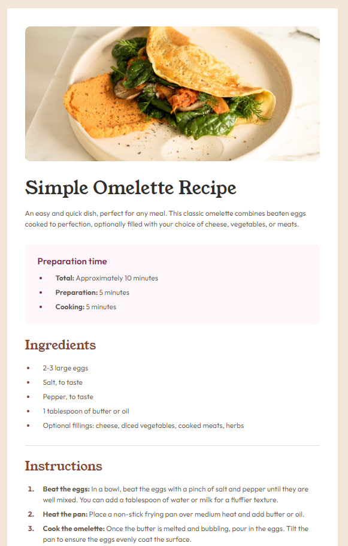

# Frontend Mentor - Recipe page solution

This is a solution to the [Recipe page challenge on Frontend Mentor](https://www.frontendmentor.io/challenges/recipe-page-KiTsR8QQKm). Frontend Mentor challenges help you improve your coding skills by building realistic projects.

### Screenshot

### Links

-   [Solution URL](https://github.com/AfterWaGa/FM_Recipe)
-   [Live Site URL](https://afterwaga.github.io/FM_Recipe/)

## Author

-   [Website](https://github.com/AfterWaGa)
-   [Frontend Mentor @AfterWaGa](https://www.frontendmentor.io/profile/AfterWaGa)
